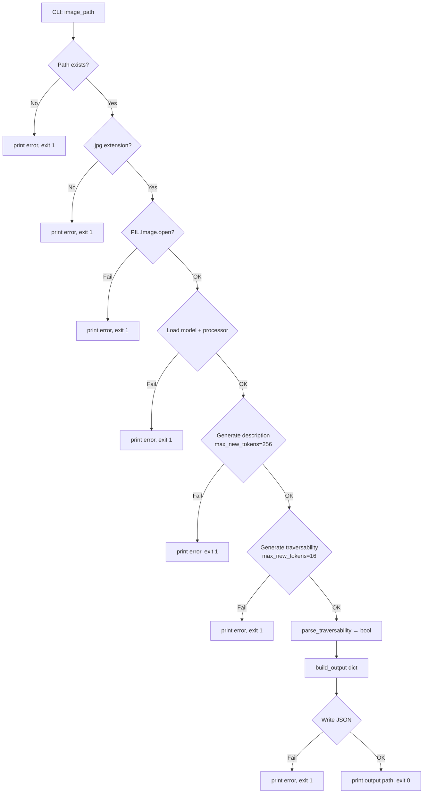

# Design Document: Multimodal Demo Alternatives

## Overview

This feature adds three new Vision-Language Model (VLM) demo scripts to `src/multimodal_interpretation/`:

| Script | Model | HuggingFace ID |
|---|---|---|
| `llavaDemo.py` | LLaVA-1.5-7B | `llava-hf/llava-1.5-7b-hf` |
| `moondreamDemo.py` | Moondream2 | `vikhyatk/moondream2` |
| `internVLDemo.py` | InternVL2-2B | `OpenGVLab/InternVL2-2B` |

Each script is a self-contained CLI tool that mirrors the structure of the existing `qwenDemo.py`: it accepts a `.jpg` image path, loads an open-weights VLM via HuggingFace Transformers, generates a scene description and a traversability boolean, and writes a JSON output file. No shared library or base class is introduced — the scripts are intentionally standalone for ease of use and comparison.

### Model Selection Rationale

All three models are ≤8B parameters, open-weights, and strong on scene-understanding benchmarks:

- **LLaVA-1.5-7B** — Mature, widely benchmarked multimodal model. Uses CLIP ViT-L/14 vision encoder + Vicuna-7B LLM. Strong on VQA and scene description tasks. Loaded via `LlavaForConditionalGeneration` + `AutoProcessor`.
- **Moondream2** — Extremely compact (~1.9B params). Designed for edge/embedded inference. Uses its own `AutoModelForCausalLM`-compatible interface with a custom `encode_image` / `answer_question` API. Fastest of the three.
- **InternVL2-2B** — 2B parameter model from the InternVL2 family, which achieves state-of-the-art results among sub-8B VLMs on MMBench and other scene-understanding benchmarks. Uses `InternVLChatModel` + `AutoTokenizer` via HuggingFace.

---

## Architecture

All three scripts share the same linear pipeline:

```
CLI arg → validate path/extension → open image → load model+processor
    → generate description (max 256 tokens)
    → generate traversability (max 16 tokens)
    → parse traversability to bool
    → build output dict
    → write JSON
    → print output path
```

Each failure point calls `sys.exit(1)` with a descriptive message. There is no shared module — each script is fully self-contained.



---

## Components and Interfaces

### Shared Helper Functions (per-script, not a shared module)

Each script implements the same two pure helper functions:

#### `parse_traversability(response: str) -> bool`

```python
def parse_traversability(response: str) -> bool:
    return response.strip().lower().startswith("yes")
```

Returns `True` iff the response starts with `"yes"` (case-insensitive). All other responses — including `"no"`, empty strings, and ambiguous outputs — return `False`.

#### `build_output(image_path: str, description: str, traversability: bool) -> dict`

```python
def build_output(image_path: str, description: str, traversability: bool) -> dict:
    return {
        "imageName": os.path.basename(image_path),
        "imageDescription": description,
        "traversability": traversability,
    }
```

Returns a dict with exactly three keys: `imageName`, `imageDescription`, `traversability`.

### Model-Specific Loading Patterns

Each model has a slightly different HuggingFace API:

#### LLaVA-1.5-7B (`llavaDemo.py`)

```python
from transformers import LlavaForConditionalGeneration, AutoProcessor

processor = AutoProcessor.from_pretrained("llava-hf/llava-1.5-7b-hf")
model = LlavaForConditionalGeneration.from_pretrained(
    "llava-hf/llava-1.5-7b-hf", torch_dtype=torch.float16
)
```

LLaVA-1.5 uses a specific prompt template with `USER:` / `ASSISTANT:` markers and an `<image>` token placeholder:

```
USER: <image>\n{prompt}\nASSISTANT:
```

The `AutoProcessor` handles image preprocessing and tokenization together. Inputs are built with `processor(text=prompt_text, images=image, return_tensors="pt")`.

#### Moondream2 (`moondreamDemo.py`)

```python
from transformers import AutoModelForCausalLM, AutoTokenizer

tokenizer = AutoTokenizer.from_pretrained("vikhyatk/moondream2", revision="2025-01-09")
model = AutoModelForCausalLM.from_pretrained(
    "vikhyatk/moondream2", revision="2025-01-09",
    trust_remote_code=True, torch_dtype=torch.float16
)
```

Moondream2 exposes a high-level `model.query(image, question)` method that returns a string directly, bypassing the standard `generate()` call. The image is passed as a PIL `Image` object. `trust_remote_code=True` is required. A pinned `revision` is used for reproducibility.

#### InternVL2-2B (`internVLDemo.py`)

```python
from transformers import AutoModel, AutoTokenizer

tokenizer = AutoTokenizer.from_pretrained(
    "OpenGVLab/InternVL2-2B", trust_remote_code=True
)
model = AutoModel.from_pretrained(
    "OpenGVLab/InternVL2-2B", trust_remote_code=True,
    torch_dtype=torch.float16
)
```

InternVL2 uses a `model.chat(tokenizer, pixel_values, question, generation_config)` interface. The image must be preprocessed into `pixel_values` using the model's `build_transform` utility and converted to a tensor. `trust_remote_code=True` is required.

### CLI Interface (all three scripts)

```
python {script}.py <image_path>
```

- One positional argument: path to a `.jpg` file.
- Exit code `0` on success, `1` on any error.
- On success, prints: `Output written to: <path>`

---

## Data Models

### JSON Output Schema

All three scripts produce the same JSON structure:

```json
{
    "imageName": "test1.jpg",
    "imageDescription": "The scene shows a paved road...",
    "traversability": true
}
```

| Field | Type | Description |
|---|---|---|
| `imageName` | `string` | `os.path.basename(image_path)` |
| `imageDescription` | `string` | Generated description, whitespace-stripped |
| `traversability` | `boolean` | `true` if response starts with "yes" (case-insensitive) |

### Output File Path

```python
base_name = os.path.splitext(os.path.basename(image_path))[0]
output_path = os.path.join(os.path.dirname(image_path), f"{base_name}_output.json")
```

The output file is always co-located with the input image.

---

## Correctness Properties

*A property is a characteristic or behavior that should hold true across all valid executions of a system — essentially, a formal statement about what the system should do. Properties serve as the bridge between human-readable specifications and machine-verifiable correctness guarantees.*

### Property 1: Traversability parsing is a total function on "yes"-prefix

*For any* string, `parse_traversability` SHALL return `True` if and only if the string, after stripping and lowercasing, starts with `"yes"`. For all other strings it SHALL return `False`.

**Validates: Requirements 4.2, 4.3**

### Property 2: Description whitespace is stripped

*For any* string returned by model inference (including strings with arbitrary leading and trailing whitespace), the `imageDescription` field stored in the output dict SHALL equal `response.strip()`.

**Validates: Requirements 3.4**

### Property 3: `build_output` always produces exactly three fields

*For any* combination of `image_path` (string), `description` (string), and `traversability` (bool), `build_output` SHALL return a dict whose key set is exactly `{"imageName", "imageDescription", "traversability"}`.

**Validates: Requirements 5.2**

### Property 4: Output path is always co-located with the input image

*For any* valid image file path, the output JSON path SHALL be in the same directory as the input image and SHALL be named `{imageBaseName}_output.json`.

**Validates: Requirements 5.1**

### Property 5: Non-.jpg extensions are always rejected

*For any* file path whose extension is not `.jpg` or `.JPG` (i.e., any case-insensitive non-match), the script SHALL exit with a non-zero status code without writing any output file.

**Validates: Requirements 1.3**

---

## Error Handling

Every failure path follows the same pattern:

```python
except Exception as e:
    print(f"Error: <context-specific message>: {e}")
    sys.exit(1)
```

The seven guarded failure points in each script are:

| Step | Exception type(s) | Error message prefix |
|---|---|---|
| Path existence | — (explicit check) | `"Error: File not found:"` |
| Extension check | — (explicit check) | `"Error: Expected a .jpg file, got"` |
| Image open | `IOError`, `UnidentifiedImageError` | `"Error: Could not open image"` |
| Model/processor load | `Exception` | `"Error: Failed to load <ModelName> model:"` |
| Description inference | `Exception` | `"Error: Model inference failed during description generation:"` |
| Traversability inference | `Exception` | `"Error: Model inference failed during traversability assessment:"` |
| JSON write | `Exception` | `"Error: Failed to write output file:"` |

All error messages are printed to `stdout` (matching `qwenDemo.py` convention) and the process exits with code `1`.

---

## Testing Strategy

### PBT Applicability Assessment

This feature is well-suited for property-based testing on its pure helper functions (`parse_traversability`, `build_output`, output path construction, extension validation). The model inference pipeline itself is not suitable for PBT due to the cost and latency of real model calls — those paths are covered by edge-case unit tests using mocks.

### Unit Tests

Focused on specific examples and error conditions:

- **CLI validation**: zero args, two args, one valid arg → correct behavior
- **Extension check**: `.png`, `.jpeg`, `.bmp`, `.JPG` (valid), `.jpg` (valid) → correct accept/reject
- **Image open failure**: file with `.jpg` extension but invalid content → exit 1
- **Model load failure**: mock `from_pretrained` to raise → exit 1
- **Inference failure (description)**: mock `generate` to raise → exit 1
- **Inference failure (traversability)**: mock `generate` to raise → exit 1
- **JSON write failure**: mock `open` to raise `PermissionError` → exit 1
- **Success path**: mock all model calls → verify JSON written with correct fields and stdout message
- **Prompt strings**: verify exact prompt text is used in model calls
- **`max_new_tokens` values**: verify `256` for description, `16` for traversability
- **`torch_dtype`**: verify `torch.float16` or `"auto"` is passed to `from_pretrained`

### Property-Based Tests

Using a property-based testing library (e.g., `hypothesis` for Python). Each test runs a minimum of 100 iterations.

**Property 1 — Traversability parsing correctness**
- Tag: `Feature: multimodal-demo-alternatives, Property 1: parse_traversability is True iff response starts with yes (case-insensitive)`
- Generator: strings starting with any case variant of `"yes"` (→ expect `True`); arbitrary strings not starting with `"yes"` (→ expect `False`)

**Property 2 — Description whitespace stripping**
- Tag: `Feature: multimodal-demo-alternatives, Property 2: description whitespace is stripped`
- Generator: arbitrary strings with random leading/trailing whitespace; verify stored value equals `s.strip()`

**Property 3 — `build_output` field completeness**
- Tag: `Feature: multimodal-demo-alternatives, Property 3: build_output always produces exactly three fields`
- Generator: arbitrary `image_path` strings, `description` strings, `traversability` booleans; verify key set

**Property 4 — Output path co-location**
- Tag: `Feature: multimodal-demo-alternatives, Property 4: output path is co-located with input image`
- Generator: arbitrary valid file paths; verify output path directory and filename pattern

**Property 5 — Non-.jpg extension rejection**
- Tag: `Feature: multimodal-demo-alternatives, Property 5: non-.jpg extensions are always rejected`
- Generator: arbitrary file extensions that are not `.jpg` (case-insensitive); verify the extension check function returns the rejection signal
